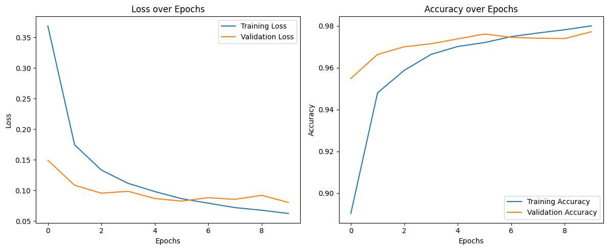
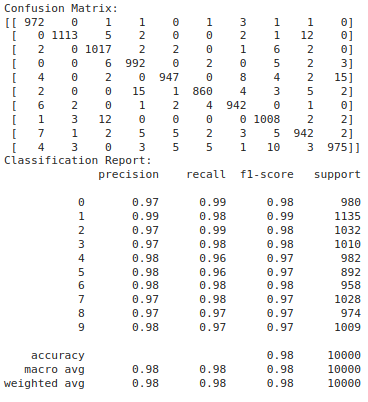

# Project Based Experiment
## Objective :
 Build a Multilayer Perceptron (MLP) to classify handwritten digits in python
## Steps to follow:
## Dataset Acquisition:
Download the MNIST dataset. You can use libraries like TensorFlow or PyTorch to easily access the dataset.
## Data Preprocessing:
Normalize pixel values to the range [0, 1].
Flatten the 28x28 images into 1D arrays (784 elements).
## Data Splitting:

Split the dataset into training, validation, and test sets.
Model Architecture:
## Design an MLP architecture. 
You can start with a simple architecture with one input layer, one or more hidden layers, and an output layer.
Experiment with different activation functions, such as ReLU for hidden layers and softmax for the output layer.
## Compile the Model:
Choose an appropriate loss function (e.g., categorical crossentropy for multiclass classification).Select an optimizer (e.g., Adam).
Choose evaluation metrics (e.g., accuracy).
## Training:
Train the MLP using the training set.Use the validation set to monitor the model's performance and prevent overfitting.Experiment with different hyperparameters, such as the number of hidden layers, the number of neurons in each layer, learning rate, and batch size.
## Evaluation:

Evaluate the model on the test set to get a final measure of its performance.Analyze metrics like accuracy, precision, recall, and confusion matrix.
## Fine-tuning:
If the model is not performing well, experiment with different architectures, regularization techniques, or optimization algorithms to improve performance.
## Visualization:
Visualize the training/validation loss and accuracy over epochs to understand the training process. Visualize some misclassified examples to gain insights into potential improvements.

# Program:
```md
Sam Israel D
212222230128
Date - 12/11/2024
```
```python
import tensorflow as tf
from tensorflow.keras import layers, models
import numpy as np
import matplotlib.pyplot as plt
from sklearn.model_selection import train_test_split
from sklearn.metrics import confusion_matrix, classification_report

# Step 1: Dataset Acquisition
# Load MNIST dataset from Keras
(x_train_full, y_train_full), (x_test, y_test) = tf.keras.datasets.mnist.load_data()

# Step 2: Data Preprocessing
# Normalize pixel values to the range [0, 1]
x_train_full, x_test = x_train_full / 255.0, x_test / 255.0

# Flatten 28x28 images into 1D arrays (784 elements)
x_train_full = x_train_full.reshape(-1, 28 * 28)
x_test = x_test.reshape(-1, 28 * 28)

# Step 3: Data Splitting (Split into training, validation, and test sets)
x_train, x_val, y_train, y_val = train_test_split(x_train_full, y_train_full, test_size=0.2, random_state=42)

# Step 4: Model Architecture
# Build the MLP model
model = models.Sequential([
    layers.Dense(128, activation='relu', input_shape=(28*28,)),  # Input layer (784) + 1st hidden layer (128 neurons)
    layers.Dropout(0.2),  # Dropout layer to prevent overfitting
    layers.Dense(64, activation='relu'),  # 2nd hidden layer (64 neurons)
    layers.Dropout(0.2),
    layers.Dense(10, activation='softmax')  # Output layer (10 neurons for 10 classes)
])

# Step 5: Compile the Model
model.compile(optimizer='adam',
              loss='sparse_categorical_crossentropy',  # Suitable for integer labels (0-9)
              metrics=['accuracy'])

# Step 6: Training
history = model.fit(x_train, y_train, 
                    epochs=10, 
                    batch_size=32, 
                    validation_data=(x_val, y_val))

# Step 7: Evaluation on the Test Set
test_loss, test_acc = model.evaluate(x_test, y_test)
print(f'Test accuracy: {test_acc:.4f}')


# Step 8: Visualization
# Plot the training and validation loss/accuracy over epochs
plt.figure(figsize=(12, 5))

# Loss Plot
plt.subplot(1, 2, 1)
plt.plot(history.history['loss'], label='Training Loss')
plt.plot(history.history['val_loss'], label='Validation Loss')
plt.title('Loss over Epochs')
plt.xlabel('Epochs')
plt.ylabel('Loss')
plt.legend()

# Accuracy Plot
plt.subplot(1, 2, 2)
plt.plot(history.history['accuracy'], label='Training Accuracy')
plt.plot(history.history['val_accuracy'], label='Validation Accuracy')
plt.title('Accuracy over Epochs')
plt.xlabel('Epochs')
plt.ylabel('Accuracy')
plt.legend()

plt.tight_layout()
plt.show()

# Step 10: Confusion Matrix and Classification Report
y_pred = np.argmax(model.predict(x_test), axis=-1)

# Confusion Matrix
conf_matrix = confusion_matrix(y_test, y_pred)
print('Confusion Matrix:')
print(conf_matrix)

# Classification Report
print('Classification Report:')
print(classification_report(y_test, y_pred))
```

## Output:

